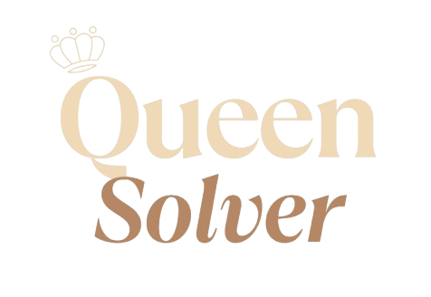
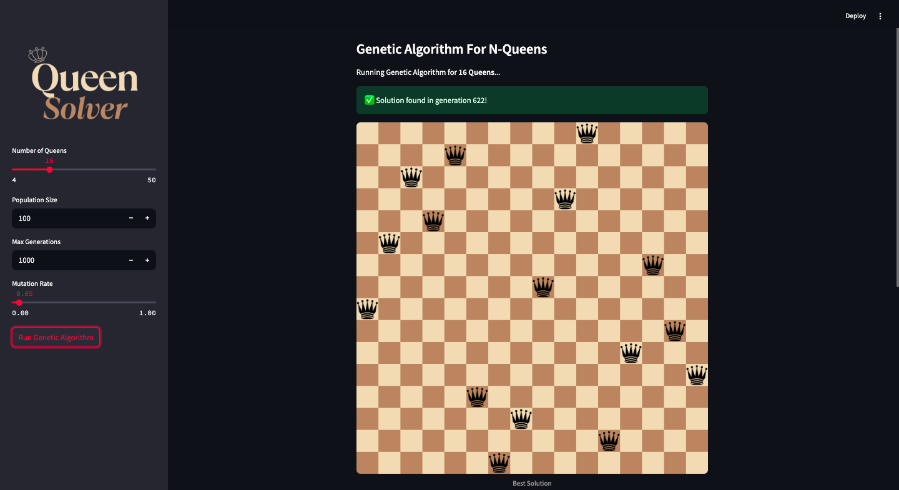
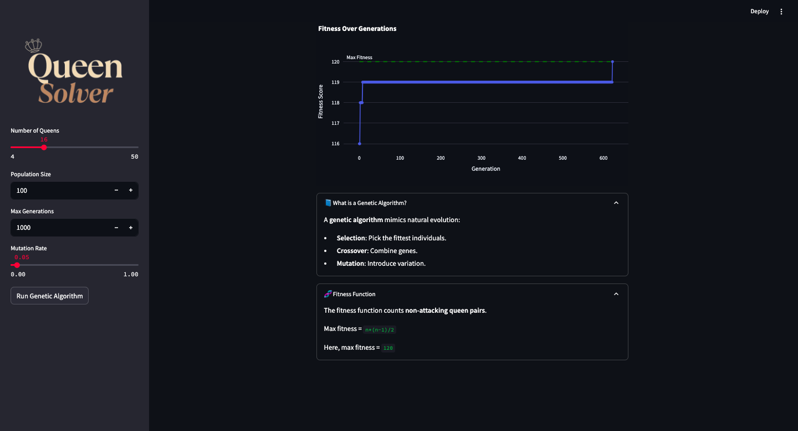

<h1 align="center">
        
</h1>

<div align="center">

[](https://queensolver.streamlit.app/)

</div>




A Streamlit-based visualization app that uses a **Genetic Algorithm** to solve the classic **N-Queens problem**. It’s a fun and interactive way to understand evolutionary algorithms in action!

---

## Features

- 🧬 Genetic Algorithm logic modularized for reusability
- 🎯 Real-time fitness evolution graph (with Plotly)
- 🖼️ Chessboard visual with queen images
- 🎛️ Sidebar to configure:
  - Number of Queens
  - Population Size
  - Mutation Rate
  - Number of Generations
- 🧠 Interactive explanation of GA concepts (via expanders)

---

## Project Structure

```
QueenSolver/
│
├── app.py               # Streamlit UI
├── assets/
│   └── queen.png        # PNG for the queen piece
├── ga/
│   ├── __init__.py
│   ├── algorithm.py       # Main GA logic
│   ├── board.py         # Board rendering logic
│   └── utils.py         # Helpers like fitness(), crossover(), mutation()
├── environment.yml      # Conda environment setup
├── requirements.txt
├── .gitignore
├── LICENSE
└── README.md

```

---

## Setup Instructions

### Using Conda (recommended)

```bash
conda env create -f environment.yml
conda activate nqueens-ga
streamlit run app.py
```

### Or with pip

```bash
pip install -r requirements.txt
streamlit run app.py
```

---

## How It Works

The Genetic Algorithm evolves a population of potential board configurations by mimicking **natural selection**:

1. **Initialization**: Randomly shuffle queens on the board
2. **Fitness**: Score based on non-attacking queen pairs
3. **Selection**: Pick the fittest individuals
4. **Crossover**: Combine parents to produce offspring
5. **Mutation**: Swap queens to maintain genetic diversity

Goal: Maximize fitness to reach a solution with **zero conflicts**.

---

## Example Output




---